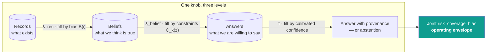
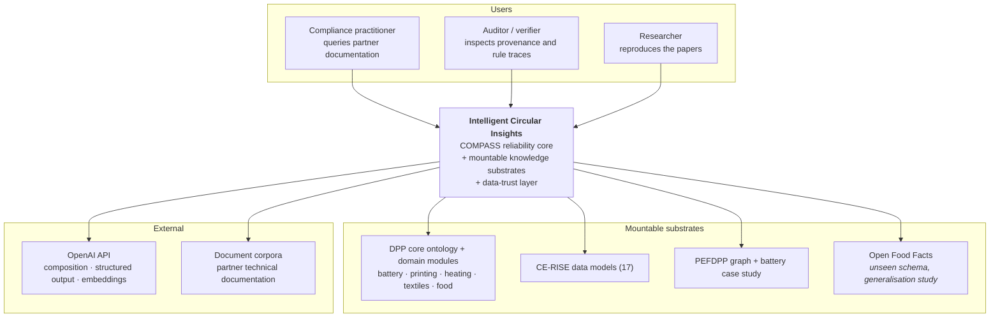
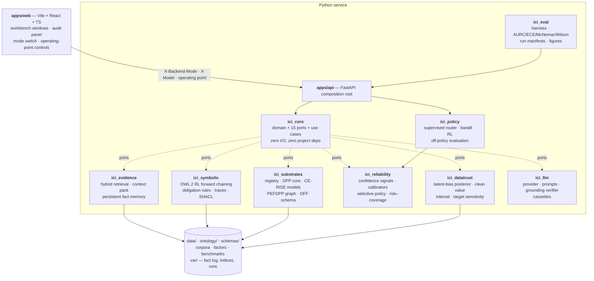
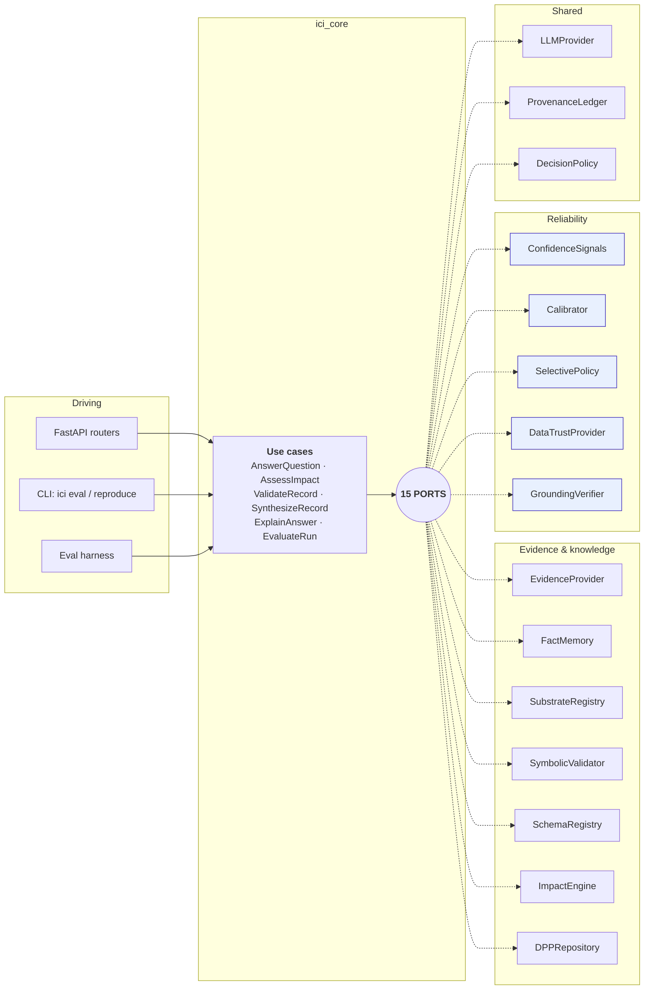
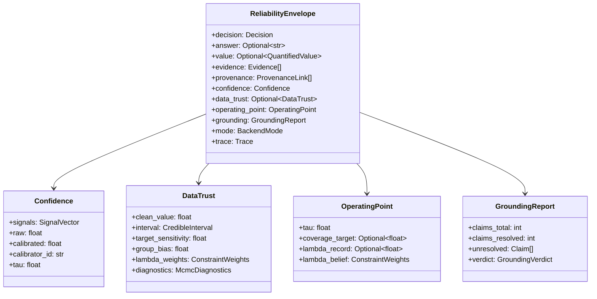
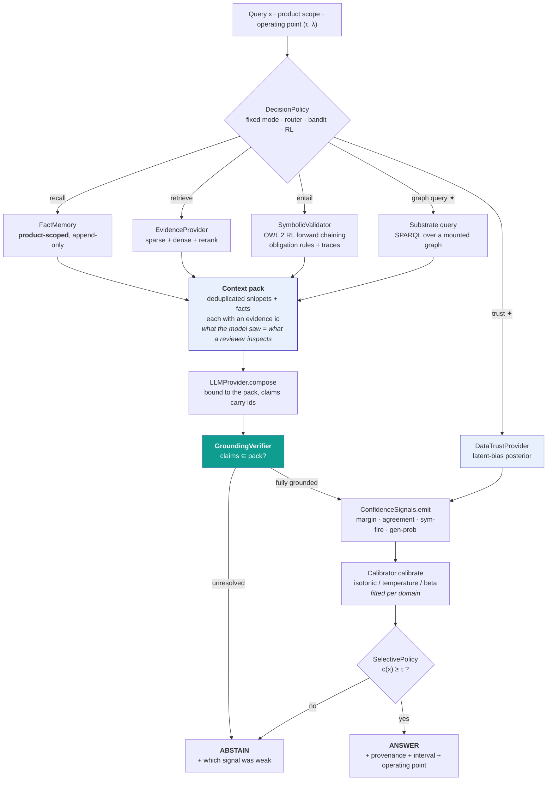
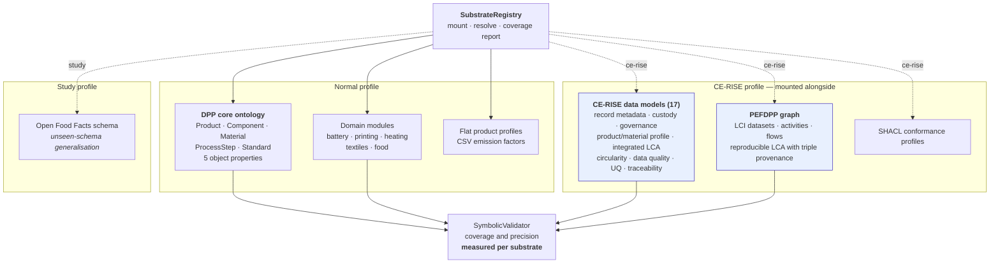
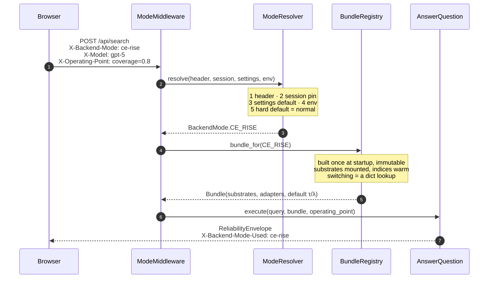
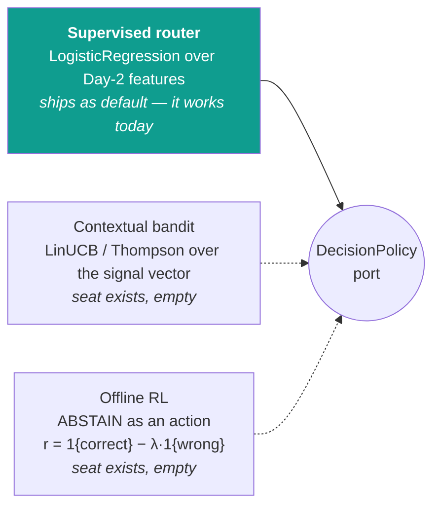

# Intelligent Circular Insights — Architecture

**Repository:** `codeberg.org/CE-RISE-software/intelligent-circular-insights`
(mirror on GitHub, Zenodo DOI per tag)
**Status:** target architecture for the `revamp/` rewrite. Authoritative — code that
disagrees with this document is a bug in the code or a missing ADR.
**Revision:** v2, 19 September 2026. *v1 was organised around the PEFDPP ontology. That
was wrong: PEFDPP is one mountable substrate, not the architecture.*

---

## 0. What this system is

**This is COMPASS, rebuilt to carry the research programme forward.**

COMPASS is a reliability-first architecture for querying product records: every output is
an evidence-grounded answer with provenance, or an explicit abstention. Four stages —
evidence acquisition, targeted symbolic validation, context-bound composition, calibrated
decision — with three principles: *evidence before generation*, *targeted validity*,
*selective output*.

The published system reaches 0.9749 accuracy on the reliability suite, AURC 0.0117,
symbolic precision 1.000 at 7.96 % fire rate, and ECE 0.021 on the unseen Open Food Facts
schema. It also has four limitations the paper states about itself. **This rewrite does not
try to close them experimentally** — that is research work on a research budget. What it
does is put each one behind a seam, so the experiment becomes possible later without
touching the call sites, and fix the parts that are plain engineering defects:

| Published limitation | The seam this architecture provides | Fixed here? |
|---|---|---|
| In-domain ECE 0.5247, worse than RAG-Base's 0.487 | `Calibrator` port with isotonic (default), temperature and vector implementations present; signals exposed as a named vector rather than collapsed to a scalar | **No** — swappable, not swept |
| Memory session-scoped, no provenance validation, supersession or correction history | `FactMemory` port with product-scoped recall, append-only storage, `supersede()`, `history()` | **Yes** — cross-product recall is a correctness bug in a compliance tool |
| "Evidence before generation" is prompting, not guarantee | `GroundingVerifier` between composition and confidence; unresolved claim ⟹ abstain | **Yes** — cheap, and it removes a real failure mode |
| RL router shows no significant improvement | `DecisionPolicy` port; the supervised router ships as default, the bandit and RL seats exist | **No** — the seat exists, the evaluation does not happen here |

Two further directions the architecture must carry:

- **Bias-aware selective QA** (the ICTAI work). COMPASS abstains when evidence is *missing*.
  The next contribution abstains when recorded values are *present but systematically
  biased*, using a constraint-calibrated latent-bias posterior. That needs a port, not a fork.
- **Substrate plurality.** The symbolic layer's reach is bounded by what it can check —
  7.96 % of the workload today. Mounting richer knowledge substrates (CE-RISE data models,
  the PEFDPP graph, domain ontologies, an unseen schema like OFF) is how coverage goes up
  without precision going down. That is what "CE-RISE mode" actually means.

---

## 1. The organising principle: one λ-tilted spine

Three works in the programme are the same mathematical object — a base distribution tilted
by a transparent knob. The architecture makes those knobs visible in the code rather than
buried in constants. Only the first is active in this deliverable; the other two have seats
(§9.5, §10) so they can land later without a schema change.

| Work | Tilted object | Form | Knob | Lives in |
|---|---|---|---|---|
| COMPASS | **answers** | selective threshold τ over calibrated `c(x)` | operating point (coverage vs risk) | `SelectivePolicy` |
| PD-MCMC | **records** | `π_λ(i) ∝ P(i)·exp(−λ·B(i))` | fairness vs fidelity | `RecordTilt` |
| Bias-aware UQ | **beliefs** | `π_λ(z\|D) ∝ p₀(z\|D)·exp(−Σ_k λ_k·C_k(z))` | constraint strength | `DataTrustProvider` |



**Design consequence.** The knobs are configuration, not code paths. `λ` and `τ` are
request-time parameters carried in the trace and reported in the answer object, so an
auditor can see the operating point that produced a given answer. A system where the
operating point is buried in a constant cannot support the paper's claim that operating
points are *policy choices*.

---

## 2. System context



Substrates are mounted, not hard-wired. Adding one is a registry entry plus adapters, and
its effect is *measured*: symbolic coverage and precision are reported per substrate, so a
new substrate has to earn its place in the numbers.

---

## 3. Containers



**Dependency rule, enforced by `import-linter` in CI:** `ici_core` imports nothing from the
project. Every other package imports `ici_core` only. `apps/api` is the sole place that
knows the full set of adapters exists. A violation fails the build.

---

## 4. The hexagon — 15 ports

Each port exists because a mode swaps it, or because the research programme needs it replaceable later. `DPPRepository` is the plain one: Validate and Synthesize need somewhere to read and write records.

Each port exists because a paper claim depends on it being swappable and separately
measurable. Ports are `typing.Protocol`, so an adapter never imports a base class and a
test double is a dataclass.



Shaded = the five ports that did not exist in v1 of this plan and that carry the research
advance.

```python
# --- evidence and knowledge -------------------------------------------------
class EvidenceProvider(Protocol):
    def retrieve(self, q: Query, budget: RetrievalBudget) -> Sequence[Evidence]: ...


class FactMemory(Protocol):
    def recall(self, scope: ProductScope, q: Query) -> Sequence[Fact]: ...
    def commit(self, fact: Fact, validation: ValidationOutcome) -> FactId: ...
    def supersede(self, old: FactId, new: Fact, reason: str) -> FactId: ...
    def history(self, subject: SubjectRef) -> Sequence[FactVersion]: ...


class SubstrateRegistry(Protocol):
    def mounted(self) -> Sequence[Substrate]: ...
    def facts_for(self, subject: SubjectRef) -> FactGraph: ...
    def coverage_report(self) -> SubstrateCoverage: ...  # per-substrate fire rate


class SymbolicValidator(Protocol):
    def entail(self, graph: FactGraph) -> EntailmentResult: ...  # OWL 2 RL, with traces
    def validate(self, claims: Sequence[Claim], graph: FactGraph) -> ValidationReport: ...


class SchemaRegistry(Protocol):
    def profiles(self) -> Sequence[SchemaProfile]: ...
    def conform(self, record: DPPRecord, profile: ProfileId) -> ConformanceReport: ...


class ImpactEngine(Protocol):
    def assess(self, subject: SubjectRef, req: ImpactRequest) -> ImpactResult: ...
    def explain(self, result: ImpactResult, target: TargetRef) -> Provenance: ...
    def subjects(self) -> Sequence[SubjectRef]: ...  # what this engine can assess


class DPPRepository(Protocol):  # the plain one: Validate and Synthesize
    def get(self, dpp_id: DppId) -> DPPRecord | None: ...
    def put(self, record: DPPRecord) -> None: ...
    def list_ids(self) -> Sequence[DppId]: ...


# --- reliability (the research surface) -------------------------------------
class ConfidenceSignals(Protocol):
    """Each signal measures a different way an answer can be weak, and is named
    in the trace so an abstention is explainable by what was weak."""

    def emit(self, ctx: AnswerContext) -> SignalVector: ...
    def names(self) -> Sequence[SignalName]: ...


class Calibrator(Protocol):
    def fit(self, scores: Sequence[float], correct: Sequence[bool]) -> None: ...
    def calibrate(self, raw: float) -> float: ...
    def diagnostics(self) -> CalibrationDiagnostics: ...  # ECE, Brier, reliability bins


class SelectivePolicy(Protocol):
    def threshold_for(self, target: CoverageTarget) -> float: ...
    def decide(self, c: float, tau: float) -> Decision: ...


class DataTrustProvider(Protocol):
    """Null in Normal mode. In bias-aware mode returns the latent-bias posterior
    summary for an attribute query."""

    def assess(
        self, subject: SubjectRef, attribute: AttributeRef, lam: ConstraintWeights
    ) -> DataTrust: ...

    # DataTrust: clean_value, interval_half_width w, target_sensitivity s, group_bias b̂_g


class GroundingVerifier(Protocol):
    """Makes 'evidence before generation' mechanical rather than prompted."""

    def verify(self, answer: str, pack: ContextPack) -> GroundingReport: ...


# --- shared -----------------------------------------------------------------
class LLMProvider(Protocol):
    def compose(
        self,
        instruction: str,
        pack: ContextPack,
        *,
        model: str | None = None,
        max_tokens: int = 512,
    ) -> str: ...
    def structured(
        self,
        instruction: str,
        pack: ContextPack,
        schema: Mapping[str, Any],
        *,
        model: str | None = None,
    ) -> Mapping[str, Any]: ...
    def embed(self, texts: Sequence[str]) -> Sequence[Sequence[float]]: ...


class ProvenanceLedger(Protocol):
    def record(self, step: TraceStep) -> None: ...
    def trace(self, cid: CorrelationId) -> Trace: ...


class DecisionPolicy(Protocol):
    """Which action next: memory, retrieval, symbolic, graph, data-trust, answer, abstain."""

    def act(self, obs: Observation) -> Action: ...
    def update(self, episodes: Sequence[Episode]) -> PolicyStats: ...
```

---

## 5. The reliability envelope

Every use case returns this, in every mode. It is the paper's output contract as a type.



**Three invariants, enforced at construction and asserted in every contract test:**

1. `decision == ANSWER ⟹ len(provenance) > 0` — the reliability claim.
2. `decision == ANSWER and answer is not None ⟹ grounding.verdict == FULLY_GROUNDED` — the *enforced* version of
   "evidence before generation". Unresolved claims force abstention; no configuration flag
   disables this.
   A deterministic numeric-only result may use `NOT_APPLICABLE`; it still needs
   provenance and calibrated confidence. See ADR 0009 for the explicit distinction
   and request-scoped LLM audit without changing the frozen port signatures.
3. `decision == ANSWER ⟹ confidence.calibrated ≥ operating_point.tau` — and `tau` is in the
   response, so the operating point that produced an answer is auditable.

`Confidence.signals` is the named vector — retrieval margin, snippet agreement, symbolic
fire flag, generation probability, and (when the data-trust layer is active) negative
posterior width and negative target sensitivity. The paper says "an abstention can be
explained by what was weak"; this makes that a field rather than a claim.

---

## 6. The inference path



✦ = available when the relevant substrate is mounted / the data-trust layer is enabled.
The path is the published four-stage architecture with two additions that are the research
advance: the grounding verifier between composition and confidence, and the data-trust
channel feeding the signal vector.

---

## 7. Substrates, and what "CE-RISE mode" means

A **substrate** is a mounted source of structured facts that the symbolic layer can check
against. `SubstrateRegistry` mounts them; each declares what subjects it covers, what facts
it can supply, and what it can be queried with.



**Why this matters to the research and not just the demo.** COMPASS's symbolic layer fires
on 7.96 % of the workload with observed precision 1.000. That precision is the contribution;
the coverage is the limitation. Each substrate mounted is a *measured* attempt to widen
coverage while holding precision — and `SubstrateCoverage` reports fire rate and conditional
precision per substrate, so the paper can say exactly which knowledge bought which reach.

PEFDPP is valuable here precisely because it is a real graph with triple-level provenance:
questions about environmental performance become checkable rather than retrievable. But it
is one substrate. Nothing in the core knows it exists.

### 7.1 What the switch changes — route, never substitute

Mounting knowledge is only half of it. The mode has to change what the five features
*do* — Search & Answer, Carbon, Validate, Repair, Synthesize — or it is a window, not a
backend. Three ports differ between the two bundles (`substrates`, `impact`, `schemas`);
every port on the reliability path is shared **by identity**, so a confidence figure means
the same thing in both modes.

The rule those three follow is the same one, and it is worth stating once because it is not
obvious and getting it wrong is expensive:

> When two sources model **different things**, route between them. Do not substitute one
> for the other, and do not conjoin them.

Both halves of that have cost a bug.

**Substituting.** An early draft swapped the impact engine when the mode flipped, and Carbon
stopped working for the five products the graph has never heard of. The repair — making the
mode purely *additive* — removed the breakage by removing the difference, and was pinned by
a test asserting the two modes differed in exactly one port. That test then guarded the
absence of the feature for three sprints.

The two engines are not interchangeable and no amount of care makes them so. The graph
solves `BatteryPackPEFStudy` — a foreground inventory over a documented proxy factor pack,
declared per kilowattHour — at 0.059384 kg CO₂ eq. The factor table totals
`generic_bev_pack_60kwh` at 21,362 kg CO₂e over a whole product lifecycle. Different system
boundaries, different functional units, four orders of magnitude apart. Mapping one onto the
other to make the switch *do something* would produce a confidently wrong number, which is
worse than doing nothing. `LayeredImpactEngine` gives each engine the subjects it declares
and names the answering engine in every result, so a graph-solved figure is never mistaken
for a table-multiplied one.

**Conjoining.** The same reasoning applies to schemas, and the first attempt there failed
too. The EU DPP schema and the CE-RISE data models share **not one top-level term** — a
passport declares `dpp_id`, `product`, `materials`; `ProductSystem` declares
`product_system_identifier`, `activity_references`, `reference_flow_specification` — and
every CE-RISE root model closes its object. A conjunction of the two is therefore not merely
strict, it is *unsatisfiable*: no document conforms to both, and a mode that checked both
would reject every record ever written. Synthesis failing is what surfaced this.

`LayeredSchemaRegistry` routes instead, on **vocabulary rather than validity**: a model
recognises a record when it knows all of the record's top-level terms. Routing on
conformance would invert the useful behaviour — the more broken a CE-RISE document is, the
less likely it would be recognised as one, so a `ProductSystem` with a single wrong type
would be told it was missing `dpp_id`. A record recognised by exactly one model is checked
against that model; everything else, including an empty object, falls back to the regulatory
profile, because the CE-RISE models declare no required fields and routing an unrecognised
record to one of them would answer "conforms" about a document nothing had understood.

Validate, Repair and Synthesize all take their profile from the bound registry
(`SchemaRegistry.default_profile()`) rather than from a literal, so adding a mode moves all
three at once. The response names the profile that **ran**, never the one requested.

`tests/e2e/test_the_mode_switch_changes_the_features.py` is where this contract lives: one
class per feature, each asserting the difference the switch makes *and* the behaviour it
must not break, together.

---

## 8. Mode resolution

Per-request, via `X-Backend-Mode`, mirroring the existing `X-Model` convention. A mode is a
named bundle: a substrate set, an adapter set, and a default operating point.



`X-Backend-Mode-Used` on every response, so the UI cannot misreport which backend answered.
Both bundles are resident; the 41 MB EF elementary-flow list stays lazy-loaded off the hot
path.

---

## 9. Research seams — what this architecture makes possible later

This repository is a CE-RISE deliverable. It is not the evidence package for a paper, and
nothing here re-runs an experiment. But the programme continues after this hand-off, and an
architecture that forecloses the next experiment is a bad architecture even if it ships.

So each open question gets a **seam**: a port, a null implementation, and a place to plug in.
Building the seam costs hours. Not building it costs a rewrite.

### 9.1 Calibration

`Calibrator` is a port. Isotonic ships as the default because it is what the system does
today. Temperature and a **vector calibrator over the full signal vector** are present but
unfitted.

The vector one is there for a specific reason. Signals are currently collapsed to a scalar
`ĉ(x)` before a monotone map is applied, and a monotone map of a scalar cannot recover what
the collapse discarded — which is a plausible explanation for in-domain ECE 0.5247 against
0.021 on OFF. Testing that is a research exercise on a research budget. Making it *testable*
is twenty lines and a `Protocol`, and without them the experiment needs a refactor first.

The signals also stop being internal: `SignalVector` is a named, inspectable field on the
envelope. That is what lets an abstention say which signal was weak, which the paper claims
and the UI should show.

### 9.2 Memory — fixed here, because it is a defect

§4.2's limitations are not all research. Session-scoped recall means a query about product A
can return a fact committed about product B. In a compliance tool that is the worst quiet
failure available, so `FactMemory` is product-scoped, append-only, and supersedes rather than
overwrites, with `history()` for the correction chain. Four properties, four tests, a
morning's work.

### 9.3 Grounding — fixed here, because it is cheap

`GroundingVerifier` sits between composition and the confidence step: decompose the answer
into claims, resolve each against the context pack, abstain on any that does not resolve.

This does not prove parametric knowledge never leaks — no black-box method does, and the
paper is right to be careful about the claim. It does mean an answer containing a claim that
resolves to nothing cannot reach a user, which is the part that matters operationally.

### 9.4 Substrates

`SubstrateRegistry` mounts knowledge; `coverage_report()` exposes symbolic fire rate and
conditional precision per substrate. The report is available; running it across a corpus to
publish a coverage claim is not work in this plan.

### 9.5 Data trust

`DataTrustProvider` is a port with a null implementation in both shipped modes. The
bias-aware work (`bias_aware_qa/`, 5,091 LoC — latent-bias posterior, clean value, credible
interval, target sensitivity) can land behind it later, and the envelope already carries
`data_trust` and `operating_point` fields so that landing is additive rather than a schema
change.

Cost of the seam now: a `Protocol`, a null class, two optional fields. Cost of adding it
later without the seam: reworking every response type and every consumer.

---

## 10. The policy seat

`DecisionPolicy` is a port. Three implementations can sit in it:



The router ships because it is the configuration that works. The other two seats exist
because the published RL result — "no significant improvement… not claimed as a
contribution" — is a conclusion worth revisiting with a better setup, and the setup changes
are architectural: state should be the confidence signal vector rather than six hand-made
features, and `ABSTAIN` should be an action so the risk–coverage trade-off is learned rather
than applied afterwards. A contextual bandit rung is probably the right next attempt, since
most of this problem is contextual rather than sequential.

None of that is evaluated here. The seven evaluation modes (RAG-Base, Mem, Sym-Only,
Mem+Sym, Router, RL, COMPASS) stay runnable as policy configurations, with one smoke test
each, because they are part of what CE-RISE is being handed.

---

## 11. Repository layout

```
revamp/
├── apps/
│   ├── api/                    FastAPI composition root; deps.py is the only
│   │                           module that imports every adapter package
│   └── web/                    Vite + React + TS; envelope renderer, audit panel,
│                               mode switch, operating-point controls, compare view
├── packages/
│   ├── ici_core/               domain · 15 ports · use cases   (no I/O, no project deps)
│   ├── ici_evidence/           hybrid retrieval · context pack · persistent fact memory
│   ├── ici_symbolic/           OWL 2 RL · obligation rules · traces · SHACL
│   ├── ici_substrates/         registry · DPP core · CE-RISE models · PEFDPP · OFF
│   ├── ici_reliability/        signals · calibrators · selective policy · risk–coverage
│   ├── ici_datatrust/          latent-bias posterior · clean value · interval · sensitivity
│   ├── ici_llm/                provider · prompts · grounding verifier · cassettes
│   ├── ici_policy/             router · bandit · RL · off-policy evaluation
│   └── ici_eval/               harness · metrics · manifests · figures
├── ontology/                   DPP core + domain modules + PEFDPP + SHACL shapes
├── schemas/                    CE-RISE (vendored) · EU DPP · OFF · mappings
├── data/                       corpora · factors · benchmarks · examples
├── tests/                      unit · contract · integration · golden · e2e · property
├── docs/                       architecture · testing · verification · adr/
├── tooling/                    Makefile · pyproject · ruff · mypy · CI · pre-commit
└── var/                        gitignored: fact log, indices, runs, artifacts
```

---

## 12. Cross-cutting decisions

| Area | Decision |
|---|---|
| Runtime | Python `>=3.10,<3.13` (device has 3.10), CI matrix 3.10 + 3.12; Node 22 |
| Packaging | `uv` workspace; each `packages/*` an installable distribution |
| Typing | `mypy --strict` on `ici_core`; nothing untyped crosses a port |
| Layering | `import-linter` contract in CI |
| Config | `pydantic-settings`; no `os.getenv` outside the settings module |
| Determinism | seeds everywhere; each request's trace carries model, prompt hash, mode, calibrator id and τ, so a response can be explained after the fact |
| Evaluation code | the harness (`ici_eval`: AURC, ECE, McNemar, Wilson, risk–coverage, figures) ports across and works — running sweeps with it is a separate exercise on a separate budget |
| LLM spend | every interaction cassette-recorded once and replayed; the test suite runs with no API key |
| Secrets | `.env` gitignored, `gitleaks` in CI |
| Licence | **EUPL-1.2** for our code (the target repo already carries it); vendored CE-RISE data models stay segregated under CC-BY-NC-4.0 with REUSE metadata — ADR 0009 |
| Release | Codeberg tag → GitHub mirror → Zenodo archive + DOI |

---

## 13. What must not break

`CE-RISE-Demo/` stays untouched and runnable throughout, as the regression oracle. Golden
responses are captured from it *before* any adapter is written, and Normal mode must
reproduce them byte-for-byte modulo timestamps, correlation ids and float noise beyond
published precision.

Everything below keeps working, unchanged, in Normal mode:

- Search & Answer (overall and single-DPP) with the audit panel — retrieved memory,
  document passages, fired ontology rules, derived triples, calibrated confidence,
  abstain status. *The audit panel is the architecture made visible; it is also what the
  paper points at as in-use evidence, so it is load-bearing, not decoration.*
- Carbon: 6 grounded products, stage-wise CO₂e, uncertainty band, recyclability donut, audit
- Validate & Repair: per-field traffic lights, grounded LLM fills, accept/reject, export
- Synthesize DPP: 3-step wizard → JSON / Markdown / PDF / QR
- CE-RISE Models: the 17-model catalogue, routing, alignment
- PEF Studio: calculator, value chain, provenance, competency questions
- Model switch `gpt-4o-mini ↔ gpt-5` via `X-Model`, honoured per request
- The seven evaluation modes — RAG-Base, Mem, Sym-Only, Mem+Sym, Router, RL, COMPASS — as
  runnable policy configurations with a smoke test each; they are part of what CE-RISE is
  being handed
