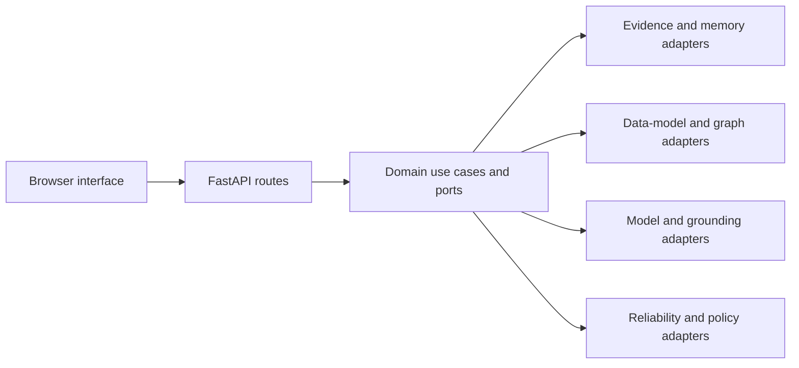

# Architecture

Intelligent Circular Insights has a React/TypeScript browser interface and a
FastAPI service. The API composes domain use cases with adapters for evidence,
data models, validation, reliability and model assistance. The source runs as
one Python service; the browser calls its `/api` routes.

```mermaid
flowchart LR
    WEB[Browser interface] --> API[FastAPI routes]
    API --> CORE[Domain use cases and ports]
    CORE --> EVID[Evidence and memory adapters]
    CORE --> SUB[Data-model and graph adapters]
    CORE --> LLM[Model and grounding adapters]
    CORE --> REL[Reliability and policy adapters]
```

## Code boundaries

| Location | Responsibility |
|---|---|
| `apps/web` | Browser screens, API client and presentation of evidence, validation and traces |
| `apps/api` | HTTP routes, settings, backend resolution and bundle construction |
| `packages/ici_core` | Domain types, ports and use cases |
| `packages/ici_evidence` | Document retrieval and in-process fact memory |
| `packages/ici_substrates` | Model catalogue, JSON Schema profiles, study graph and impact adapters |
| `packages/ici_symbolic` | Rule-based validation and derivation |
| `packages/ici_llm` | Model providers, request budgets, cassettes and grounding checks |
| `packages/ici_reliability`, `ici_policy`, `ici_datatrust`, `ici_eval` | Confidence and policy components, data-trust interface and evaluation code |

The `ici_core` package depends on ports, not concrete adapters. The API builds
provider bundles at startup in `apps/api/bundles.py`; its routes obtain the
selected bundle through `apps/api/deps.py`. The dependency direction is checked
by the repository's import-linter contract.

## Backend resolution

Requests can select `normal` or `ce-rise` with `X-Backend-Mode`. The API resolves
that choice against enabled bundles and returns the served mode in
`X-Backend-Mode-Used`. An unknown or disabled choice falls back to the configured
default with a warning header. The browser displays the served mode, not merely
the requested preference.

The Normal bundle searches the included document corpus, keeps product-scoped
facts in process memory, and offers the EU DPP and available CE-RISE JSON Schema
profiles. The CE-RISE bundle builds on Normal and adds structured facts from a
mounted study graph. Its default record profile routes a recognised CE-RISE
document to the corresponding model and other documents to the EU DPP profile.
Named profiles are respected in either backend. The model catalogue describes
schemas and is not itself a source of product-instance facts.

The backend switch also routes impact requests to an engine that declares
coverage for the requested subject. These example calculations have their own
sources and functional units; they are not part of the passport validation or
generation workflow.

## Record and answer paths

**Query:** `AnswerQuestion` retrieves bounded evidence, uses applicable
structured facts and rules, composes an answer, checks grounding, and returns
either an answer with provenance or a stated abstention. **Single passport**
uses the same reliability path with only the document supplied for that request.

**Validate:** `ValidateRecord` checks a JSON record against the selected
profile and reports typed violations with locations. The EU DPP profile checks
its required fields; CE-RISE model profiles check vocabulary and types but have
no required root fields.

**Repair and generate:** `SynthesizeRecord` uses supplied facts and retrievable
record evidence. Repair returns sourced fills separately from unresolved fields
and optional, unapplied model suggestions. Generation returns a record only
after field-level grounding and validation against the applied profile.

These operations use the same request-scoped model controls and audit trace.
`LLM_CASSETTE_MODE=replay` is the default; it makes no provider call and may
decline when no recorded response matches. Validation and other deterministic
operations do not require a model key.

## State and deployment

The shipped fact memory is in process and is not restored on restart. The API
reads configuration from environment variables or `.env` in the repository
root. Included corpora, schemas and graph data live under `data/`, `schemas/`
and `ontology/`; the API must run with the repository as its working directory.
The frontend uses same-origin `/api` calls in a deployed installation and a
Vite proxy during local development. See [Run from source](run-from-source.md)
for both setups and [Testing](TESTING.md) for verification commands.

The original, more extensive [architecture design record](https://codeberg.org/CE-RISE-software/intelligent-circular-insights/src/branch/main/docs/architecture-design-record.md)
is retained for its rationale and research directions. Proposed features in that
record should not be read as current capabilities.
