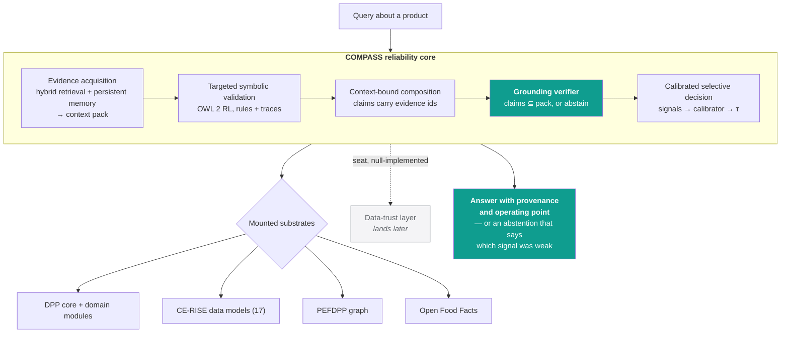

# Intelligent Circular Insights — the plan

**What we are doing.** Rebuilding COMPASS as a clean, layered, tested codebase with two
interchangeable backends — the current fast path, and one built on the CE-RISE data models
and the WP3 ontology — and handing it to CE-RISE at
`codeberg.org/CE-RISE-software/intelligent-circular-insights`.

**What we are not doing.** Re-running experiments. This is a software deliverable for the
consortium, not the evidence package behind a paper. Testing is moderate end-to-end coverage
on mid and edge cases. Where the research has open questions, the architecture leaves a seam
so the experiment stays possible later — building the seam costs hours, not building it
costs a rewrite.

**Where.** `llmmain/revamp/`. `CE-RISE-Demo/` stays untouched and runnable throughout, as
the regression oracle.

**Read in this order:** this file → `ARCHITECTURE.md` → `SPRINTS.md` → `TESTING.md`.
Codex starts at `CODEX_TASKS.md`.

> **Revision v3.** v1 was organised around the PEFDPP ontology — wrong centre; that is WP3
> work, useful here as one mountable substrate. v2 corrected the centre to COMPASS but
> planned ten sprints, four of which existed to re-run the papers' experiments. v3 keeps the
> architecture and drops the experiments: **six sprints, roughly two days.**

---

## 1. Why a rewrite rather than a refactor

**Two backends is an architectural requirement, not a feature.** Bolting a mode switch onto
the current structure means `if mode == "ce-rise"` branches through six feature modules,
which doubles the surface area and halves the confidence in both paths. Behind ports it is a
swap of an adapter bundle, and one test suite covers both sides.

**The repo is going out under a DOI.** Riccardo's template mints one per git tag and
archives to Zenodo, so whatever we push becomes citable and permanent, and other consortium
partners will read it. The current demo is good demo code — 9,561 lines doing something
genuinely hard — but it has one test file, a `main.py.pre-pefdpp` beside `main.py`, and
`os.getenv` inside business logic. That is fine for a demo and not fine for a hand-off.

**A few things are plain defects worth fixing on the way.** Memory recall is session-scoped,
so a query about product A can return a fact recorded about product B — in a compliance tool
that is the worst kind of quiet failure. Grounding is enforced by prompting alone, so an
answer containing an unsupported claim can reach a user. Both are a morning's work each once
the ports exist.

**What we are not doing:** rewriting the logic. The retrieval, the OWL 2 RL reasoner, the
composition guards, the carbon engine, the LCA solve all work and represent real effort.
They are ported file by file behind interfaces, with a frozen reference set proving the
outputs did not move.

## 2. The shape of it

"Normal mode" and "CE-RISE mode" are two named bundles: a substrate set, an adapter set and
a default operating point. The core does not know which is active.

---

## 3. What exists today

| Asset | Size | Where it goes |
|---|---|---|
| `CE-RISE-Demo/backend` | 9,561 LoC — 6 windows, the live workbench | `ici_evidence` + `ici_symbolic` + `ici_substrates` + use cases, Sprint 1 |
| `CE-RISE-Demo/frontend` | 4,879 LoC TS/React | `apps/web` — ports across largely as-is, plus mode switch and audit-panel additions, Sprint 3 |
| `llmmain/backend` | 10,676 LoC — memory, symbolic, retrieval, confidence, router, RL, 25 eval modules | `ici_reliability` + `ici_policy` + `ici_eval`, Sprint 1 — ported and working, not exercised |
| `bias_aware_qa/` | 5,091 LoC — `DataTrustLayer`, fusion, isotonic calibration, AURC/ECE/Wilson | **not ported now**; `DataTrustProvider` is a null-implemented seat it can land in later |
| PEFDPP graph + LCA | 1,592 LoC + 16 TBox + 8 ABox TTL | one substrate, Sprint 2 |
| CE-RISE model catalogue | 17 modules in `ce_rise_models.py` | an enforceable substrate, Sprint 2 |
| The 7 evaluation modes | RAG-Base · Mem · Sym-Only · Mem+Sym · Router · RL · COMPASS | configurations of `DecisionPolicy`, preserved with a smoke test each, Sprint 1 |
| Example corpora | 11 DPPs + 1 inquiry sample + 3 broken | golden-test corpus |
| Tests | 9 files against ~20,200 LoC in the two backends | ~280 tests, under 5 min, no API key |

---

## 4. The decisions

Recorded as ADRs; the short version:

**Hexagonal, with `typing.Protocol` ports.** Fifteen of them, each existing because a paper
claim depends on it being swappable and separately measurable. `ici_core` imports nothing
from the project, enforced in CI.

**Mode is an adapter-and-substrate bundle, resolved per request.** `X-Backend-Mode`,
mirroring the existing `X-Model` convention. Both bundles resident; switching is a dict
lookup, so the compare view is possible.

**One reliability envelope, with three enforced invariants.** Answering implies non-empty
provenance, implies fully-resolved grounding, implies calibrated confidence above the τ that
is itself reported. The paper's output contract, expressed as a type.

**Golden responses captured from the running demo before any adapter is written.** "Don't
break what works" is a diff, not a promise.

**Operating points are request parameters, not constants.** τ travels in the request, lands
in the trace and comes back in the answer, so a response can be explained after the fact.

**Research seams, not research work.** Where the programme has an open question, the
architecture provides a port and a null implementation — and stops there. Building the seam
is hours; the experiment is a separate exercise on a separate budget (`ARCHITECTURE.md §9`).

**Cassettes, not live calls.** Every LLM interaction is recorded once and replayed. The test
suite runs with no API key, so neither agent nor CI can spend money by running tests.

---

## 5. Sequence

| Sprint | Owner | ~Time | Delivers |
|---|---|---|---|
| S0 Foundation + 15 ports | C | 4h | skeleton, contracts, CI |
| S0x LLM port + grounding + cassettes | X | 4h | the LLM layer, and the reason tests cost nothing to run |
| S1 Normal mode ported | C+X | 10h | every current feature, behind ports, outputs unchanged |
| S2 CE-RISE substrates | C | 8h | CE-RISE data models + WP3 ontology as the second backend |
| **S3 Mode switch + frontend** | C+X | 5h | **both modes live — the milestone** |
| S4 Reliability polish | C | 4h | memory scoping, grounding wired, calibrator port |
| S5 Package + release | C | 3h | clean clone, tag, mirror, Zenodo |

**Roughly two days with both of us in parallel.** Day one gets to the end of S1 — clean
architecture, every window working in Normal mode. Day two is S2–S5: the CE-RISE backend,
the switch, the polish, the tag.

The single biggest cost in the old plan was running queries against OpenAI. That is now a
one-off: Codex records cassettes once in S1, on `gpt-4o-mini`, a few dollars total, and
every test run afterwards replays from disk with no key set.

## 6. What improves, and what only gets a seam

Two different things, and the plan is honest about which is which.

**Fixed here** — engineering defects, cheap, no experiment needed:

| | Why it matters |
|---|---|
| Memory becomes product-scoped, append-only, superseding, with history | session-scoped recall can return another product's facts; in a compliance tool that is the worst quiet failure available |
| `GroundingVerifier` between composition and confidence | an answer containing a claim that resolves to nothing in the context pack cannot reach a user |
| Typed errors and capability boundaries | a mode that cannot serve a feature returns a 422 with a reason instead of a 500 |
| Signals exposed as a named vector | an abstention can say which signal was weak — which the UI should show and currently cannot |

**Seam only** — the port exists, the experiment does not happen here:

| | The seam | Why build it now |
|---|---|---|
| Calibration (in-domain ECE 0.5247 vs 0.021 on OFF) | `Calibrator` port; isotonic ships, temperature and a vector calibrator sit unfitted | signals are collapsed to a scalar before calibration today; testing whether that is the problem needs a refactor first unless the port exists |
| Policy (RL shows no significant improvement) | `DecisionPolicy` port; router ships, bandit and RL seats empty | the fix is architectural — state should be the signal vector, `ABSTAIN` should be an action |
| Bias-aware abstention | `DataTrustProvider` port with a null implementation; envelope already carries `data_trust` and `operating_point` | adding it later without the seam means reworking every response type |
| Symbolic reach | `SubstrateRegistry.coverage_report()` | the instrument exists; pointing it at a corpus is a separate exercise |

A seam costs a `Protocol`, a null class and a couple of optional fields. Skipping one costs a
rewrite when the next paper needs it.

## 7. What blocks us, and on whom

| Blocker | Who | When |
|---|---|---|
| Codeberg username → Riccardo, for team access | you | before first push |
| Vendor the 17 CE-RISE models — run `tooling/fetch_ce_rise_models.sh` locally (codeberg is 403 from both sandboxes). Not blocking: a placeholder stands in. | you | Sprint 2 |
| OpenAI key for Codex's cassette recording — **one-off, a few dollars on `gpt-4o-mini`** | you → Codex | Sprint 1 |
| Whether `revamp/` is the new repo root or a subdirectory | you | before first push |

Everything else is ours.

---

## 8. Risks

| Risk | Mitigation |
|---|---|
| Rewrite loses undocumented behaviour | a reference set frozen from the running demo *before* any adapter is written |
| Two modes drift into two products | one contract suite, both implementations; the S3 gate is 6 windows × 2 modes |
| Porting 20k LoC overruns two days | the reference set makes each port verifiable in isolation, so the work parallelises cleanly and a half-done sprint is still shippable |
| OpenAI spend creeps | cassettes recorded once; a cache miss fails the test rather than making a live call; CI runs with no key |
| Frontend rebuild eats the schedule | the existing frontend ports across largely as-is — the changes are the mode switch, the badge, and the audit panel additions |
| The 41 MB flow list makes startup unusable | stays lazy; one test asserts the cold-start budget |
| Proxy factors mistaken for compliant results | badged in every response and on every screen |
| CE-RISE models unavailable (codeberg 403 from both sandboxes) | placeholder generated from the catalogue already in `ce_rise_models.py`; you vendor the real ones when convenient |

## 9. Definition of done

1. `git clone && make setup && make test && make demo` works on a clean machine
2. Every window works in both modes; switching is a Settings toggle
3. Nothing that worked in CE-RISE-Demo stopped working — proven by the reference set
4. All seven evaluation modes still run
5. Every answer carries provenance and a grounding verdict; every abstention names the weak signal
6. Memory cannot return another product's facts
7. The test suite runs in under five minutes with no API key
8. `ruff`, `mypy`, `import-linter`, `gitleaks` clean; coverage floor met
9. Tagged, mirrored to GitHub, archived to Zenodo with a concept DOI
