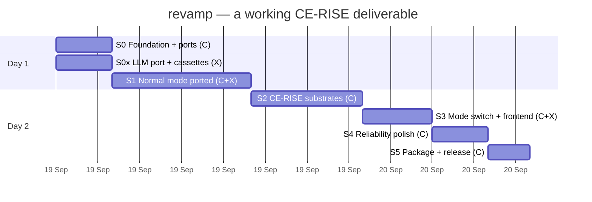
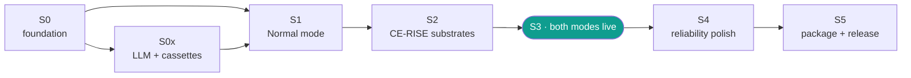

# Sprint plan — `revamp/`

Six sprints. **C** = Claude, **X** = Codex. Roughly two working days with both of us in
parallel.

**Revision v3.** v2 planned ten sprints, four of which existed to re-run the papers'
experiments — calibration sweeps, off-policy evaluation, the bias-aware benchmark. Those are
out of scope. This is a **CE-RISE software deliverable**, not the evidence package for a
reviewer. The architecture keeps the seams those experiments would need, so they can be run
later without touching this code, but running them is not work in this plan.

---

## What that changes

| v2 | v3 |
|---|---|
| 10 sprints, ~5 days | **6 sprints, ~2 days** |
| Research gates: ECE below a CI, McNemar significance, R̂ ≤ 1.05 | **gone** — the ports exist, the experiments happen elsewhere |
| Golden capture of every endpoint × every example | **a focused set**: representative + edge cases per window |
| ~600 unit tests, 95 % coverage floor, mutation testing | **moderate**: end-to-end on mid and edge cases, tight unit tests only where the maths matters |
| 24-cell parity matrix (6 × 2 modes × 2 models) | **12 cells** — one model; the second is one smoke test |
| Nightly live OpenAI runs, per-instance prediction releases | **cassettes only**; one manual live smoke |
| `PAPER_SYNC.md` | **gone** |

**The scarce resource is OpenAI calls, not typing.** Every LLM interaction is recorded once
into a cassette and replayed forever after. The full test suite runs with `OPENAI_API_KEY`
unset. Cassette recording happens once, in Sprint 1, on `gpt-4o-mini`, and costs a few
dollars total.

---

## Timeline





---

## Sprint 0 — Foundation and ports · **C** · ~4h

**Goal.** Structure in place, contracts declared, CI green on an empty implementation.

- `uv` workspace; packages per `ARCHITECTURE.md §11`; `apps/api`, `apps/web`
- `ici_core`: domain types and the 15 `Protocol` ports
- Use-case skeletons with real signatures
- `BundleRegistry` + `ModeResolver` + DI in `apps/api/deps.py`
- Envelope invariants enforced at construction
- `tooling/`: ruff, mypy on `ici_core`, `import-linter`, pytest, pre-commit, gitleaks;
  CI on Woodpecker + GitHub Actions; `Makefile`
- ADRs 0001–0008 (already drafted)

**Codex, in parallel (S0x):** `ici_llm` — OpenAI adapter, `ModelRouter`, the `llm_compat.py`
rules ported verbatim, `GroundingVerifier`, and the `CassetteProvider` that makes everything
downstream free to run.

**Gate**

```bash
make check                       # ruff + mypy + import-linter
pytest -m contract               # collected, xfail(NotImplemented)
pytest tests/test_invariants.py  # envelope invariants unbypassable
```

---

## Sprint 1 — Normal mode ported · **C + X** · ~10h · *the bulk of the work*

**Goal.** Every current feature working, behind ports, with the outputs unchanged.

**First, freeze a reference set** — a focused one, not an exhaustive capture:

```bash
python tooling/capture_reference.py --base http://localhost:8000 --out tests/reference/
```

Per window: **two representative queries and two edge cases.** Roughly 30 recorded
responses, not several hundred. Enough to catch a port that silently changed behaviour;
small enough to read when one legitimately changes.

**Claude ports:**

| From | LoC | To |
|---|---|---|
| `core/demo_search.py` | 1371 | `ici_evidence/retrieval/` + `context_pack.py` |
| `core/search_service.py` | 215 | `ici_evidence/retrieval/scoring.py` |
| `core/memory_service.py` | 280 | `ici_evidence/memory/` |
| `core/symbolic_reasoning_service.py` | 642 | `ici_symbolic/` |
| `core/carbon_calculation_service.py` | 1343 | `ici_substrates/carbon/` |
| `core/carbon_ontology_service.py` | 653 | same, audit + provenance |
| `core/carbon_query_service.py` | 460 | use case + adapter split |
| `api/validate.py` · `synthesize.py` · `single_dpp.py` | 1216 | use cases + routers |
| `api/ce_rise_models.py` | 592 | `ici_substrates/registry/catalog.py` |
| `llmmain/backend/services/confidence.py`, `policy_router.py` | — | `ici_reliability/signals/`, `ici_policy/router.py` |
| `llmmain/backend/eval/*`, `bias_aware_qa/calibrate.py`, `selective.py` | — | `ici_eval/`, `ici_reliability/calibration/` — **ported, not exercised** |

The last row matters: the evaluation and calibration code comes across so the harness exists
and works, but no sweep runs here. It is a capability of the deliverable, not a task in it.

**The seven evaluation modes stay runnable** — RAG-Base, Mem, Sym-Only, Mem+Sym, Router, RL,
COMPASS — as configurations of the `DecisionPolicy` port, each with one smoke test. They are
part of what CE-RISE is being handed.

**Codex:** the composition path from `api/search.py` (guards at 118, 182, 214, 227, 231, 243,
306) into `ici_llm/composition.py` + `guards.py`, feeding the `GroundingVerifier`. **Records
the cassettes once here** — after this, nobody spends another API call to run tests.

**Also in Sprint 1, moved forward from Sprint 5** (see `docs/RELEASE.md`): these three are
cheap now and expensive to retrofit.

- **Licence.** EUPL-1.2, not MIT — the target repo already carries it (ADR 0009). Decides
  the SPDX header on every source file, so it must be right before there are hundreds.
- **Repository identity.** `revamp/` gets its own `git init` and remote. It currently sits
  untracked inside the `LLMEnhance` working tree; committing from there would put this code
  in the wrong repository.
- **Template metadata.** `CITATION.cff`, `.zenodo.json`, `CHANGELOG.md` and the README are
  still Riccardo's placeholders. Filling them in while writing docs costs nothing.

**Gate**

```bash
pytest tests/reference -q                 # the frozen set still matches
pytest -m contract                        # normal side of every port
python -m ici_eval.modes --all --smoke    # 7 modes each answer once
pytest --cov=packages --cov-fail-under=70
```

---

## Sprint 2 — CE-RISE substrates · **C** · ~8h

**Goal.** The CE-RISE data models and the WP3 ontology become the second backend.

- `SubstrateRegistry`: mount, resolve subject → fact graph
- **CE-RISE data models (17)**: JSON Schema / SHACL per module, `applied_schemas`
  resolution, typed `ConformanceReport` violations with JSON-Pointer locations. CIRPASS-2
  alignment from `docs/cirpass2_mapping.md` as machine-readable `skos:closeMatch`.
- **WP3 PEFDPP ontology**: graph loader + LCA engine ported from `pefdpp_graph_service.py`
  (671) and `pefdpp_lca_service.py` (921); SHACL profile from the `:PEFRequired`
  annotations; competency questions as data with a runner; guarded read-only SPARQL. The
  41 MB elementary-flow list stays lazy — one test asserts cold start stays under budget.

**Blocked on you:** codeberg is 403 from both sandboxes. Run
`tooling/fetch_ce_rise_models.sh` locally to vendor the 17 repos. Until then this runs
against a placeholder generated from the catalogue in `ce_rise_models.py`.

**Gate**

```bash
pytest tests/substrates -q        # mounting, conformance, typed violations
pytest tests/lca -q               # the documented LCA numbers still come out
pytest tests/cq -q                # competency questions return expected shapes
pytest tests/security/test_sparql_guard.py
```

The LCA test is worth keeping tight even in a lean plan: those numbers are the visible
output of the WP3 integration, and a refactor that moves them silently is the one regression
a consortium reviewer would actually notice.

---

## Sprint 3 — Mode switch and frontend · **C + X** · **DONE, 21 Sep** · both modes live

**Goal.** Switch backends in Settings; every window works either way.

**Gate — green**

```
448 passed, 29 skipped          pytest, no API key, 19 s
22 passed                       playwright --grep smoke, 37 s, both modes
clean                           ruff check · ruff format · mypy (58 files) · import-linter (2/2)
48 modules, 216 kB / 68 kB gz   vite build
```

### Backend

`ModeMiddleware` resolves the mode once per request, stashes the resolution on
`request.state`, and stamps `X-Backend-Mode-Used` on **every** response — including the 422
a mode returns when it cannot serve a feature, which is precisely where a badge is most
likely to go stale, because the handler never ran. `get_bundle` reads the stash rather than
re-resolving, so the handler and the header cannot disagree; a test asserts the body's
`mode` equals the header. `X-Backend-Mode-Source` and `X-Backend-Mode-Warning` carry the
rest of the resolution. ADR 0012.

`ImpactEngine` gains `subjects()`, so the Carbon picker is read off the profile directory
rather than hard-coded — which is how the demo's product list drifted from its data.

### Frontend — `apps/web`, ~1,900 LoC

Built fresh against the rewrite's API rather than ported line by line: the demo's pages
call endpoints this rewrite deliberately does not have (`/api/pefdpp/*`, `/api/single-dpp/*`),
and re-adding those to satisfy the old client would undo the rewrite. `tokens.css` carried
across unchanged, so it is visibly the same product.

Six windows — Search, Carbon, Validate, CE-RISE Models, PEF Studio (4 tabs), Compare — and
three rules the pages cannot get wrong because one module enforces each:

1. **The badge reads the response, never the preference.** `mode.ts` keeps *requested* and
   *served* as separate values; amber when they differ.
2. **A 422 is a value, not an exception.** `ApiResult<T>` = `ok | declined | failed`. A
   decline renders the reason plus a button that performs the switch that would satisfy it.
3. **The audit panel shows the whole envelope**: the named signal vector with the weak
   signal highlighted, τ marked on the confidence track, the grounding verdict with claims
   resolved of total, provenance, and the inference trace.

The compare view made it in. It asks both backends at once and deliberately does **not**
let those requests move the badge — asking a specific backend must not retitle the session's.

### Three bugs the frontend found

**The Sprint 2 mistake, in a second slot.** CE-RISE mode assigned the graph into the single
`substrates` slot, and the CE-RISE Models window went **from 18 models to 0** the moment you
switched to the *more rigorous* backend. `CompositeSubstrateRegistry` composes instead, and
the invariant is now asserted directly rather than per feature — `normal_substrates <
ce_rise_substrates`, so a mode that removes knowledge fails the suite. ADR 0013, refining 0002.

**`/api/search` returned 500.** A `CassetteMiss` — correct behaviour, replay must never
touch the network — escaped as an unhandled exception. It is now a typed 422
(`model_unavailable`) with an actionable reason. Deliberately *not* folded into an
abstention: an abstention says the system reasoned and declined on confidence grounds, and
reporting a configuration problem that way would put it into the reliability statistics.
The test gap that let it ship: `/api/search` was never in the never-500 matrix. It is now.

**An unhandled exception loses the mode badge.** The 500 propagated past `ModeMiddleware`
before it could stamp a header, so the badge went blank — which is honest (nothing is known)
but made the root cause harder to see. Fixed by the fix above; the behaviour is now tested.

### Cost

No OpenAI spend. The smoke tests pick a question that matches nothing, so the pack is empty
and composition is never entered: a full envelope, no model call. One further test asserts
only that a question needing prose renders *an outcome* — answer or decline — never a blank
window.

### Running it

`node_modules` installs outside the repository and is symlinked in
(`ICI_WEB_MODULES`, default `~/.ici-web-modules`). Not a preference: installing 74 packages
into a synced folder produced thousands of file events and repeatedly killed the connection
to this machine. `ICI_CHROMIUM` points Playwright at a browser already on disk, for networks
that refuse `cdn.playwright.dev`. `bash apps/web/finish-sprint3.sh` does all of it.

**Codex.** X7, one mode-aware prompt variant, is still open and is not blocking: in CE-RISE
mode, mounted substrates are authoritative and a claim that cannot attach to a substrate
fact is abstained on.

---

## Sprint 4 — Reliability polish · **C** · ~4h

Three improvements that are cheap in code and do not need an experiment to justify:

**Memory scoping.** Product-scoped recall, append-only storage, `supersede()` rather than
overwrite, `history()`. This is a correctness fix — session-scoped recall can return another
product's facts, which in a compliance tool is a real bug, not a research nicety.

**Grounding wired through.** The `GroundingVerifier` from S0x sits between composition and
the confidence step; an unresolved claim abstains. One edge-case test set: a fabricated
claim, a citation to an id not in the pack, a correct paraphrase (must pass).

**Calibrator as a port with its implementations present.** Isotonic (current behaviour,
shipped as default), plus temperature and a vector calibrator available but unfitted. No
sweep, no ECE target — the point is that CE-RISE, or a later paper, can swap one in without
touching the call site.

**Gate**

```bash
pytest tests/memory -q        # scoping, supersession, history
pytest tests/grounding -q     # unresolved claim ⟹ abstain
pytest tests/reference -q     # nothing moved
```

---

## Sprint 5 — Package and release · **C** · ~3h

- `README` with the two-mode story, quickstart, screenshots, and the CE-RISE footer the
  template requires (EU emblem, grant 101092281)
- `CITATION.cff` and `.zenodo.json` filled in from the template placeholders;
  `CHANGELOG.md`; EUPL-1.2 SPDX headers; `reuse lint` green
- Anonymised request logging behind a flag (endpoint, mode, abstain, latency — no query
  text, no identities)
- Clean-clone check, then Codeberg tag → GitHub mirror → Zenodo archive

**Gate**

```bash
git clone <fresh> && cd revamp && make setup && make test && make demo
```

---

## Keeping the OpenAI bill down

This is the constraint that shapes the plan, so it gets its own section.

1. **Record once, replay forever.** Codex records cassettes in Sprint 1 on `gpt-4o-mini`.
   Every test run afterwards — local, CI, both agents — replays from disk. `OPENAI_API_KEY`
   stays unset in CI.
2. **A cache miss fails loudly.** If a prompt drifts, the test errors rather than quietly
   making a live call. You cannot accidentally spend money by running the suite.
3. **The reference set is small on purpose.** ~30 responses, two representative and two edge
   per window. Capturing hundreds would cost real money and catch almost nothing extra.
4. **One model in the test matrix.** `gpt-4o-mini`. `gpt-5` gets a single smoke test,
   recorded once, because the compatibility rules differ and that is worth one call.
5. **Live tests are manual.** `pytest -m live` exists and is never run by CI or by a hook.
6. **No experiment sweeps.** The calibration and policy code ports across and works; running
   it over thousands of queries is a separate exercise, on a separate budget.

---

## Testing, right-sized

Moderate end-to-end coverage on mid and edge cases. Details in `TESTING.md`; the shape:

- **Per window, per mode:** two representative queries, two edge cases
- **Edge cases that matter here:** empty query · unknown product · malformed DPP upload ·
  the abstention path · unknown mode header · LLM unavailable · oversized file ·
  SPARQL injection attempt · cold start · a substrate that fails to mount
- **Tight unit tests only where the maths matters:** LCA scaling and CFF, carbon
  calculation, schema conformance, memory scoping, confidence monotonicity
- **Coverage floor 70 %** overall, 85 % on the deterministic engines. No mutation testing.

---

## Working protocol

**Ownership.** Codex: `packages/ici_llm/**`, `tests/cassettes/**`, `tests/live/**`. Claude:
everything else. The seam is `LLMProvider` + `GroundingVerifier`, frozen after Sprint 0.

**Branches.** `main` protected, `sprint/<n>-<slug>`, conventional commits, squash merge.

**Definition of done.** Public API typed · happy path plus one or two realistic failure
modes tested · contract tests pass in both modes or a `CapabilityError` is declared ·
ruff/mypy/import-linter clean · provenance emitted · the reference set still green.
