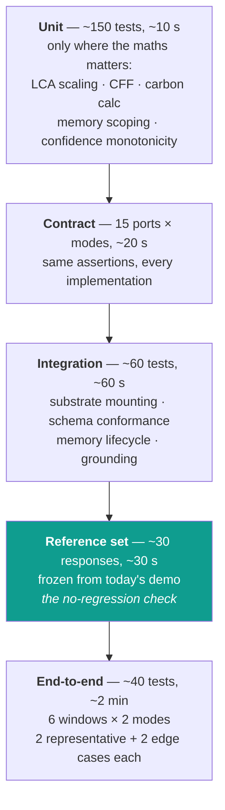
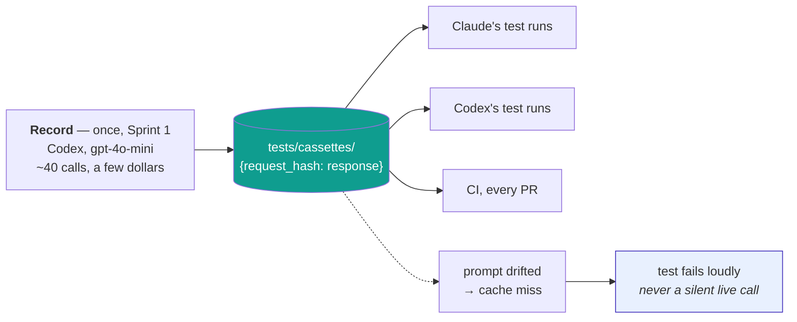
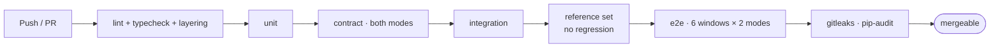

# Testing strategy

**Scope note.** This is a CE-RISE software deliverable, not the evidence package behind a
paper. Testing here exists to keep the software correct and to prove that nothing which
worked before stopped working — not to reproduce experimental claims. Moderate end-to-end
coverage on mid and edge cases, with tight unit tests only where the arithmetic matters.

**The constraint that shapes everything:** OpenAI calls cost money and time. Every LLM
interaction is recorded once into a cassette and replayed forever. The full suite runs with
`OPENAI_API_KEY` unset, and a cassette miss fails the test rather than silently making a
live call.

**Codex S1 checkpoint (2026-09-20):** 286 offline tests pass, with 94% LLM
statement coverage and 22 cassette-marked tests. Real-response goldens cover the
LLM boundary for search, repair, synthesis, grounding, GPT-5 compatibility and
OpenAI embeddings. A separate genuine cached-weight MiniLM smoke passed.
The API/E2E matrix below is the target design, not a claim that placeholder
feature routes are already implemented. Intentional legacy changes and the
user-requested unverified suggestions are documented in ADR 0011.

---

## 1. The shape



Around 280 tests total, running in under four minutes with zero API calls. That is the
right size for this deliverable — enough that a refactor cannot quietly break a window,
small enough that nobody stops running it.

---

## 2. The reference set — the no-regression check

Before any adapter is written, `tooling/capture_reference.py` drives the **existing**
CE-RISE-Demo and freezes a focused set:

```
tests/reference/
  search/       2 representative + 2 edge   (overall and single-DPP)
  carbon/       2 products + 1 unknown product
  validate/     1 valid + 2 broken DPPs
  synthesize/   1 full wizard path
  models/       catalogue + 1 routing case
  pef/          overview + calculate + 1 competency question
  modes/        one query through each of the 7 evaluation modes
```

Roughly 30 responses. Comparison normalises timestamps, correlation ids, latency and float
noise beyond displayed precision.

Capturing every endpoint × every example would cost real API spend and catch almost nothing
the focused set misses — a port that breaks behaviour breaks it on the first case, not the
fortieth. When a response legitimately changes, the diff is small enough to read.

---

## 3. Edge cases worth having

These are the ones that actually bite in this system, drawn from how it fails rather than
from a checklist:

| Case | Expected |
|---|---|
| Empty or whitespace query | 422 with a reason, not an LLM call |
| Unknown product id | abstention naming the missing evidence |
| Malformed DPP upload | typed violations, never a stack trace |
| The abstention path itself | abstains *and* says which signal was weak |
| Unknown `X-Backend-Mode` value | falls back to default, warns, does not 500 |
| LLM unavailable / rate limited | typed error surfaced; extractive fallback where one exists |
| Oversized upload | rejected at the boundary with a size message |
| SPARQL injection attempt | rejected by the guard before execution |
| Cold start | graph loads within budget; the 41 MB flow list is not loaded |
| Substrate fails to mount | the mode starts degraded and says so, rather than crashing |
| Feature a mode cannot serve | typed `CapabilityError` → 422, never a 500 |
| Cross-product memory recall | returns nothing from the other product |

The last one is a correctness bug, not a nicety: in a compliance tool, returning another
product's facts is the worst thing this system can do quietly.

---

## 4. Contract tests

One parameterised suite per port, run against every implementation:

```python
@pytest.mark.contract
@pytest.mark.parametrize("mode", [BackendMode.NORMAL, BackendMode.CE_RISE])
class TestEvidenceProviderContract:
    def test_returns_empty_not_none_when_nothing_matches(self, provider): ...
    def test_every_evidence_carries_a_resolvable_ref(self, provider): ...
    def test_respects_the_retrieval_budget(self, provider): ...
    def test_never_leaks_another_products_evidence(self, provider): ...
```

Where a mode genuinely cannot satisfy a clause, the answer is an explicit `CapabilityError`
in that port's declared capability set — never a silent behavioural difference. This is what
keeps two modes from becoming two products.

### The envelope invariants

Asserted at construction, and a test tries to build a violating envelope and asserts it raises:

1. `ANSWER ⟹ len(provenance) > 0`
2. Prose `ANSWER ⟹ grounding.verdict == FULLY_GROUNDED`; numeric-only deterministic
   results may use `NOT_APPLICABLE` (ADR 0009).
3. `ANSWER ⟹ confidence.calibrated ≥ operating_point.tau`, with τ in the response

No configuration flag relaxes any of them.

---

## 5. Unit tests — only where the maths matters

Not a coverage exercise. These are the places where a wrong number is invisible until
someone downstream trusts it:

- **LCA scaling**: doubling the functional unit doubles every scaled exchange
- **CFF**: zero credit at R2 = 0, full virgin-equivalent credit at R2 = 1, monotone between
- **Carbon calculation**: stage totals sum to the reported total; unit conversions round-trip
- **Schema conformance**: a record valid under one profile and invalid under another is
  reported as such, not silently passed
- **Memory**: supersession appends and does not mutate; recall is product-scoped
- **Confidence**: fused confidence is monotone in each signal

Plus the documented LCA outputs as a regression test — those numbers are the visible result
of the WP3 integration, and a refactor that moves them is the one regression a consortium
reviewer would actually spot.

---

## 6. Cassettes — how the suite costs nothing to run



The hash covers model, prompt text, schema and option kwargs; keys are redacted. One model
in the matrix (`gpt-4o-mini`); `gpt-5` gets a single recorded smoke test, because its
compatibility rules genuinely differ and that is worth one call.

`tests/live/` exists, is marked `@pytest.mark.live`, and is run by a human on purpose. Never
by CI, never by a hook.

The root test configuration deselects live tests unless `--run-live` is explicitly
provided. `-m live` alone does not authorize live calls. CI and `--no-network`
reject `--run-live`. Non-live tests remove `OPENAI_API_KEY` and block socket/DNS
access. S0x includes clearly labelled synthetic cassettes; live recordings are S1 work.

---

## 7. Coverage

| Package | Floor |
|---|---|
| `ici_core` | 85 % |
| Deterministic engines — `ici_substrates` (carbon, LCA), `ici_symbolic` | 85 % |
| `ici_evidence`, `ici_reliability`, `ici_policy` | 70 % |
| `ici_llm` | 65 % (cassette-replayed; live excluded) |
| `apps/api` | 70 % (routers thin by design) |
| `apps/web` | smoke only — Playwright, no unit-test floor |

Overall floor 70 %. No mutation testing. Coverage is a sanity check, not a goal: a module at
85 % with no edge-case test still fails review.

---

## 8. CI



One pipeline, under five minutes, no API key, no nightly job. If it is slow or flaky people
stop trusting it, and an untrusted suite is worse than a small one.

---

## 9. Test data policy

- No secrets, no personal data, no licensed background LCI in the repo
- Proxy emission factors ship with source and uncertainty, badged `proxy` in every response
- Deterministic seeds; a flaky test is fixed or deleted, never retried
- Fixtures beside their tests; shared corpora in `data/` with a short provenance note

---

## 10. Definition of done

1. Public API typed; nothing untyped crosses a port
2. Happy path plus one or two realistic failure modes tested
3. Contract tests pass in both modes, or a `CapabilityError` is declared and tested
4. `ruff`, `mypy`, `import-linter` clean
5. The three envelope invariants hold by construction
6. Arithmetic covered by a unit test where a wrong number would be invisible
7. New LLM interactions have a cassette
8. The reference set is still green
