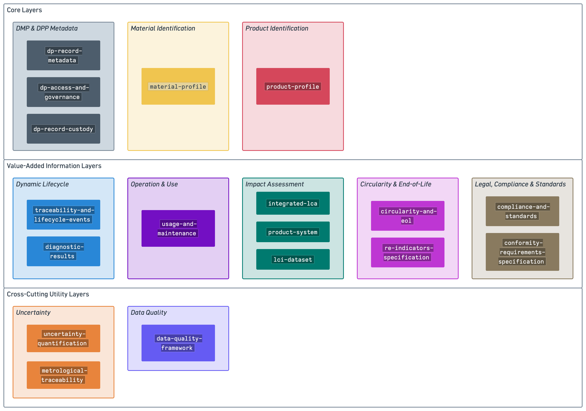

# Architecture Overview

## Graphical Representation

{: target="_blank"}

## Three-Group Architecture Structure

The CE-RISE DPP & DMP architecture is organized into three main groups containing 9 functional layers, where each group and layer serves specific purposes while maintaining interoperability across the system.

---

## A. Core Layers

The core layers form the foundation of every Digital Product or Material Passport, providing essential identity and metadata management infrastructure.

### A1. Passport Identification
**Models:**  

**`product-profile`** (required for product passports)  
Defines the immutable identity, origin, and basic specification of the product. This foundational model is static and always present in every product DPP.

**`material-profile`** (required for material passports)  
Defines the immutable identity, origin, and basic specification of the material. This foundational model is static and always present in every material DMP.

### A2. DPP & DMP Metadata
**Models:**  

**`dp-record-metadata`**  
Defines the semantic and structural metadata of the DPP or DMP record. Specifies the applied data models, profiles, ontology bindings, schema references, supported formats, validation schemas, and version information required for interpreting the content of the DPP or DMP. This is the primary metadata envelope read before processing any product or material data.

**`dp-access-and-governance`**  
Describes operational and access-related metadata for the DPP or DMP record. Defines access levels, security settings, data carrier characteristics, longevity policies, interoperability configurations, and other parameters governing how the DPP or DMP is stored, exposed, shared, and maintained across systems.

**`dp-record-custody`**  
Represents the chain of custody and governance history of the DPP or DMP record itself. Captures custody events (creation, update, transfer, archival), identifies custodians, records authorized transfers, and includes integrity evidence such as signatures or hashes. Ensures auditability, accountability, and secure lifecycle governance of the DPP or DMP as an information object.

---

## B. Value-Added Information Layers

These layers provide the rich, domain-specific information that creates value for different stakeholders throughout the product or material lifecycle.

### B1. Dynamic Lifecycle
Captures time-dependent changes and events throughout the product's journey.

**Models:**

**`traceability-and-lifecycle-events`**  
Dynamic traceability and supply-chain events. Includes only **events**, not static identifiers.

**`diagnostic-results`**  
Structured outputs produced during diagnostic, repair, service, or automated condition-assessment operations. These are **event-bound results**, not static product information.

### B2. Operation & Use
Describes how a product or material is used, maintained, and operated throughout its active life.

**Model: `usage-and-maintenance`**
Captures how a product is operated and maintained, including usage records, maintenance actions, service histories, and legally required or product-specific instructions for use and upkeep.

### B3. Impact Assessment
Supports comprehensive environmental, social, and economic impact calculations.

**Models:**

**`integrated-lca`**  
Represents integrated LCA assessment inputs, methods, results, interpretation, and reporting across environmental, social, and economic dimensions.

**`product-system`** 
Defines a calculation-specific assembly of versioned LCI datasets and selected activities, together with reference-flow specifications and assembly provenance.

**`lci-dataset`** 
Represents reusable life cycle inventory data, including activities, flows, flow objects, quantitative exchanges, contextual information, and source provenance.

### B4. Circularity & End-of-Life
Defines circularity metrics, design principles, and end-of-life pathways.

**Models:**

**`circularity-and-eol`**  
Comprehensive circularity and end-of-life information.

**`re-indicators-specification`**  
Specific end-of-life indicators and recovery options for selected products.

### B5. Legal, Compliance & Standards
Ensures regulatory compliance and standards conformity throughout the product lifecycle.

**Models:**

**`compliance-and-standards`**  
Regulatory compliance and certification information.

**`conformity-requirements-specification`**  
Specification layer for compliance and normative information needs.

---

## C. Cross-Cutting Utility Layers

These layers provide reusable components that support data quality and reliability across all other layers.

### C1. Uncertainty
**Models:**

**`uncertainty-quantification`**  
Generic structures for representing uncertainty in measurements, assessments, and indicators.

**`metrological-traceability`**  
Reusable structures for documenting the metrological and methodological reference basis of measured, calculated, method-defined, or boundary-defined values.

**Used by:** All layers where measurements, predictions, or assessments contain uncertainty

### C2. Data Quality
**Model: `data-quality-framework`**  
Defines metadata for data quality, provenance, representativeness, completeness, and assessment pedigree.

**Used by:** All layers to ensure transparency and trust in data

---

## Architecture Principles

### Modularity
Each model can be developed, updated, and deployed independently while maintaining interface compatibility.

### Interoperability
Models use standardized interfaces and semantic definitions to ensure seamless integration across different systems and platforms.

### Extensibility
The architecture allows for new models to be added within existing layers or new layers to be created as requirements evolve.

### Separation of Concerns
Each layer addresses distinct aspects of the product or material lifecycle, preventing unnecessary coupling and enabling focused expertise.

For detailed specifications and internal structure of each model, see the individual component repositories.
